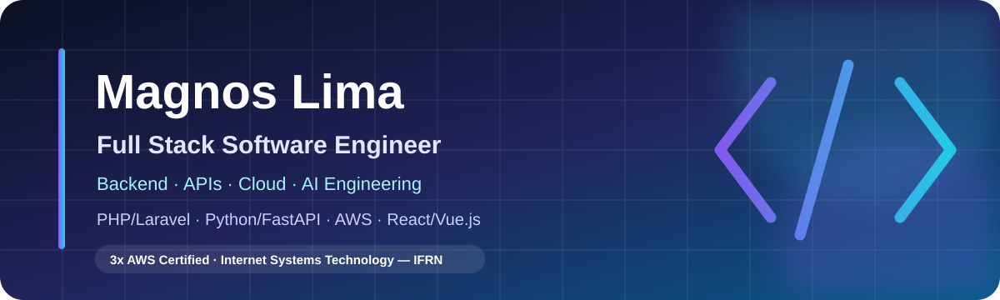

  

  
  
  

## Olá! Eu sou o Magnos 👋

Sou **Full Stack Software Engineer**, com atuação no desenvolvimento e na manutenção de aplicações web, APIs RESTful e integrações entre sistemas. Trabalho em todo o ciclo da aplicação, com maior ênfase em **backend com PHP/Laravel e Python/FastAPI**, sem deixar de lado interfaces modernas com JavaScript, Vue.js e React.

Minha experiência também envolve bancos de dados MySQL, deploy e troubleshooting em ambientes Linux/Apache, serviços AWS, testes automatizados e investigação de problemas de desempenho, cache, consultas e integrações externas.

Sou tecnólogo em **Sistemas para Internet pelo IFRN**, possuo **três certificações AWS** e continuo aprofundando meus estudos em arquitetura de software, cloud engineering, inteligência artificial e ciência de dados.

Tenho inglês intermediário (**nível B2**), com uso em leitura técnica, escrita e conversação.

## Áreas de atuação

- **Backend e APIs:** serviços RESTful, integrações externas, regras de negócio e aplicações PHP/Laravel e Python/FastAPI.
- **Desenvolvimento full stack:** construção e evolução de produtos web do banco de dados à interface.
- **Cloud e produção:** AWS, Docker, Linux, Apache, deploy, manutenção de ambientes e diagnóstico de incidentes.
- **Qualidade de software:** testes automatizados, GitFlow, SOLID, Design Patterns e arquitetura de software.

## Tecnologias

### Backend e dados

  
  
  
  
  
  
  

### Frontend

  
  
  
  
  

### Cloud, infraestrutura e engenharia

  
  
  
  
  
  
  

## Certificações AWS

- AWS Certified Solutions Architect — Associate
- AWS Certified Developer — Associate
- AWS Certified Cloud Practitioner

## Projetos públicos em destaque

| Projeto | O que ele resolve | Tecnologias |
|---|---|---|
| [Eleições 2026 — RN](https://github.com/MagnosLima/eleicoes-2026-rn) | Centraliza candidaturas do RN e da Presidência, com atualização automática a partir dos dados do TSE. [Ver site](https://candidatos-rn-2026.netlify.app/) | HTML, CSS, JavaScript, Node.js, GitHub Actions, Netlify |
| [FastAPI + Ollama Agent](https://github.com/MagnosLima/fastapi-ollama-agent-ai) | Explora agentes locais de IA por meio de uma API extensível. | Python, FastAPI, Ollama |

## Interesses profissionais

- Arquitetura e evolução de aplicações web.
- Backend, APIs e integração entre serviços.
- Cloud computing, automação e DevOps.
- Inteligência artificial aplicada a produtos digitais.
- Privacidade, segurança e qualidade de software.

## Vamos conversar?

Gosto de trocar experiências sobre desenvolvimento full stack, backend, arquitetura, cloud e aplicações de inteligência artificial. Meus repositórios públicos mostram um pouco do que venho construindo e estudando.

  <a href="https://github.com/MagnosLima?tab=repositories">Ver todos os repositórios</a>
  ·
  <a href="https://www.linkedin.com/in/magnos-lima/">Conectar no LinkedIn</a>
  ·
  <a href="https://www.instagram.com/mag.lima.ig/">Conversar pelo Instagram</a>

